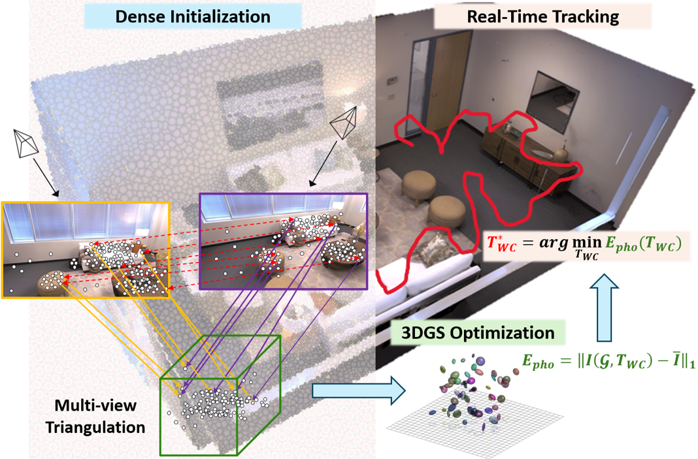
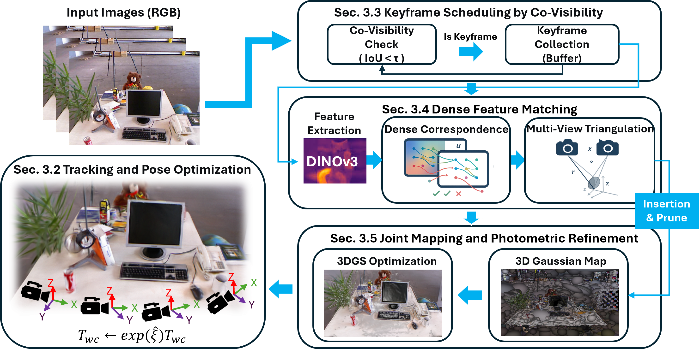

# RGS-SLAM: Robust Gaussian Splatting SLAM with One-Shot Dense Initialization

---

## 1. Abstract

We introduce RGS-SLAM, a robust Gaussian-splatting SLAM framework that replaces the residual-driven densification stage of GS-SLAM with a training-free correspondence-to-Gaussian initialization. Instead of progressively adding Gaussians as residuals reveal missing geometry, RGS-SLAM performs a one-shot triangulation of dense multi-view correspondences derived from DINOv3 descriptors refined through a confidence-aware inlier classifier, generating a well-distributed and structure-aware Gaussian seed prior to optimization. This initialization stabilizes early mapping and accelerates convergence by roughly 20%, yielding higher rendering fidelity in texture-rich and cluttered scenes while remaining fully compatible with existing GS-SLAM pipelines. Evaluated on the TUM RGB-D and Replica datasets, RGS-SLAM achieves competitive or superior localization and reconstruction accuracy compared with state-of-the-art Gaussian and point-based SLAM systems, sustaining real-time mapping performance at up to 925 FPS.

---

## 2. Overview

<p align="center">
  
</p>

RGS-SLAM integrates dense feature matching, multi-view triangulation, and a differentiable 3D Gaussian splatting (3DGS) renderer into a single SLAM system.  
Keyframes trigger dense DINOv3 feature extraction, confidence-weighted multi-view correspondence aggregation, and one-shot triangulation that spawns a fixed set of anisotropic Gaussians. Subsequent tracking and mapping refine only pose and Gaussian parameters under analytic SE(3) Jacobians, which yields a stationary optimization objective and improves both convergence speed and rendering fidelity on indoor sequences.

---

## 3. Repository Structure

```text
RGS-SLAM/
├── configs/              # YAML configuration files for all experiments
│   ├── mono/             # Monocular SLAM configs (e.g., TUM RGB-D monocular)
│   ├── rgbd/             # RGB-D configs (e.g., TUM RGB-D, Replica)
├── figures/              # Figures and example images used in the README or docs
├── gaussian_splatting/   # Core 3D Gaussian Splatting implementation and CUDA kernels
├── gui/                  # Viewer / visualization utilities for trajectories and maps
├── scripts/              # Helper scripts for running sequences and batch evaluations
├── submodules/           # Third-party libraries (diff-gaussian-rasterization, RoMa, simple-knn, …)
├── utils/                # SLAM frontend/backend utilities, datasets, evaluation helpers
├── .gitignore            # Git ignore rules
├── .gitmodules           # Submodule definitions for third-party code
├── Dependencies.md       # Detailed description of the software/hardware dependencies
├── Dockerfile            # Optional Docker image definition for reproducible environments
├── LICENSE.md            # License for this repository (research and educational use)
├── README.md             # Project description and usage instructions
├── environment.yml       # Conda environment specification for RGS-SLAM
├── requirement.txt       # Python package requirements (pip)
└── rgs_slam.py           # Main entry point for running RGS-SLAM
```

---
## 4. Architecture Overview

<p align="center">
  
</p>

RGS-SLAM follows a keyframe-based architecture that couples dense multi-view initialization with a differentiable 3D Gaussian splatting backend. The system maintains a global map of anisotropic Gaussians and alternates between front-end tracking and back-end mapping while keeping the topology of the Gaussian set fixed between keyframes.

At the front end, incoming frames are tracked against the current Gaussian map using analytic SE(3) Jacobians and a robust photometric objective. Keyframe selection is driven by a visibility- and parallax-aware policy that promotes frames only when they provide sufficient novel coverage. Once a frame is accepted as a keyframe, the system extracts dense DINOv3 features, forms confidence-weighted multi-view correspondences, and performs triangulation to obtain a set of 3D points with baseline-aware uncertainty.

These triangulated points serve as the seed for one-shot Gaussian initialization. Each point is converted into an anisotropic Gaussian with a mean at the triangulated position, a covariance aligned to the local tangent–normal frame, and an opacity proportional to correspondence confidence. This initialization produces a well-distributed and structure-aware Gaussian map before any iterative refinement, which stabilizes early optimization and reduces the need for residual-driven densification.

At the back end, RGS-SLAM jointly refines camera poses and Gaussian parameters over a sliding keyframe window. Gradients are propagated through the 3DGS renderer, and the optimization is regularized by covariance priors, opacity constraints, and an exponential moving average that anchors early estimates. Lightweight Gaussian merging and pruning keep the representation compact while preserving fine structures, leading to fast convergence, high rendering fidelity, and accurate trajectories on both TUM RGB-D and Replica scenes.

---

## 5. Installation

We recommend creating a dedicated conda environment:

```bash
# Clone repository and submodules
git clone https://github.com/Breeze1124/RGS-SLAM.git
cd RGS-SLAM
git submodule update --init --recursive

# Create environment (option A: conda)
conda env create -f environment.yml
conda activate rgs-slam

# or install via pip (option B)
pip install -r requirement.txt
```

For hardware and software details (GPU, CUDA, PyTorch version, etc.), please refer to `Dependencies.md`.

---

## 6. Datasets

RGS-SLAM is evaluated on TUM RGB-D and Replica indoor scenes, following the splits described in the paper (TUM fr1/desk, fr2/xyz, fr3/office and Replica room0–2, office0–4).

1. **TUM RGB-D**

   - Download sequences from the official TUM RGB-D website.  
   - Organize them under a root directory, for example:
     ```text
     /path/to/data/tum_rgbd/
       ├── fr1_desk/
       ├── fr2_xyz/
       └── fr3_office/
     ```
   - Update the corresponding entries in the YAML configs under `configs/mono/` or `configs/rgbd/` so that they point to your local data path.

2. **Replica**

   - Obtain the Replica dataset from the official release and extract the indoor scenes:
     ```text
     /path/to/data/replica/
       ├── room0/
       ├── room1/
       ├── room2/
       ├── office0/
       ├── office1/
       ├── office2/
       ├── office3/
       └── office4/
     ```
   - Set the dataset root in the Replica configs in `configs/rgbd/`.

---

## 7. Quick Start

Once the environment and datasets are prepared, RGS-SLAM can be launched with a single command.  
Below are example invocations; adjust the config paths to match your setup.

```bash
# RGB-D SLAM on TUM fr1/desk
python rgs_slam.py --config configs/rgbd/fr1_desk.yaml

# RGB-D SLAM on Replica office0
python rgs_slam.py --config configs/rgbd/replica_office0.yaml

# Monocular SLAM on TUM fr3/office (if enabled)
python rgs_slam.py --config configs/mono/fr3_office.yaml
```

By default, tracking runs in real time, and mapping is executed asynchronously within a bounded local window. The GUI tools in `gui/` can be used to visualize trajectories and rendered views during or after a run.

---

## 8. Qualitative Results

<p align="center">
  
</p>

The figure illustrates RGS-SLAM tracking on a Replica room0 sequence.  
Ground-truth trajectories are drawn in red and RGS-SLAM predictions in green, shown from both top-down and oblique viewpoints. The alignment between the two curves demonstrates that the one-shot Gaussian initialization preserves global consistency even under long and cluttered trajectories.

<p align="center">
  
</p>

This figure shows novel-view rendering examples on the TUM RGB sequence.  
RGS-SLAM recovers sharper edges, fewer transparency artifacts, and more stable background structures than residual-driven Gaussian SLAM baselines, while maintaining accurate object shapes across different viewpoints.

---

## 9. Citation

If you find this work useful in your research, please consider citing the paper:

```bibtex
@inproceedings{rgs-slam-2026,
  title     = {RGS-SLAM: Robust Gaussian Splatting SLAM with One-Shot Dense Initialization},
  author    = {Anonymous},
  booktitle = {Proceedings of the IEEE/CVF Conference on Computer Vision and Pattern Recognition},
  year      = {2026}
}
```

(The author list will be updated after the review process.)
